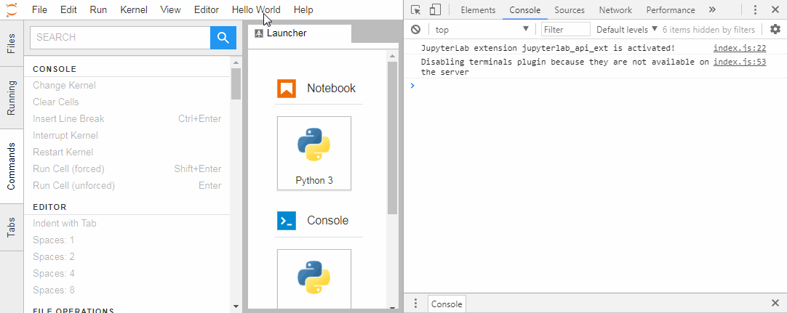

**DEPRECATED** :arrow_right: Have a look at the [official server extension example](https://github.com/jupyterlab/extension-examples) instead.

# jupyterlab_api_ext

The goal is to provide an "Hello world" example of complex extension for JupyterLab using a notebook server extension.



## Prerequisites

* JupyterLab

## Development

For a development install (requires npm version 4 or later), do the following in the repository directory:

```bash
pip install .
jupyter serverextension enable --py jupyterlab_api_ext
npm install
npm run build
jupyter labextension link .
```

In addition to the traditional TypeScript package, the python handler package needs to be installed and activated. This is the reason for the `pip` and `jupyter serverextension` commands.

To rebuild the TypeScript package and the JupyterLab app:

```bash
npm run build
jupyter lab build
```

## References

* http://jupyter-notebook.readthedocs.io/en/stable/extending/handlers.html
* https://github.com/jupyterlab/jupyterlab-git 
